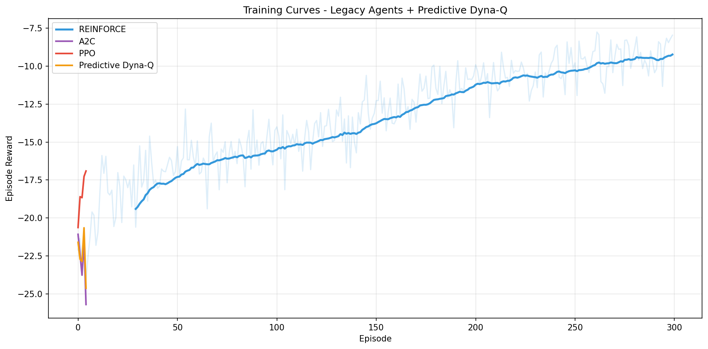
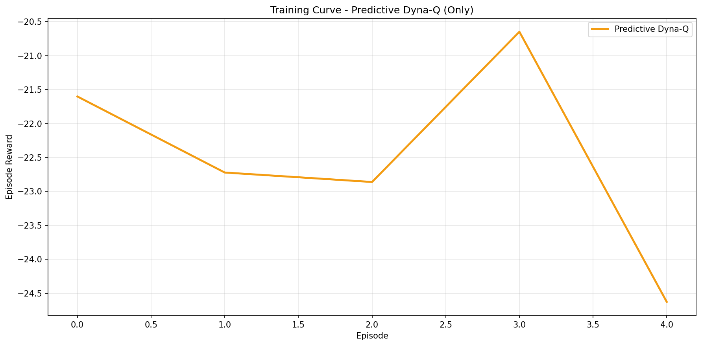
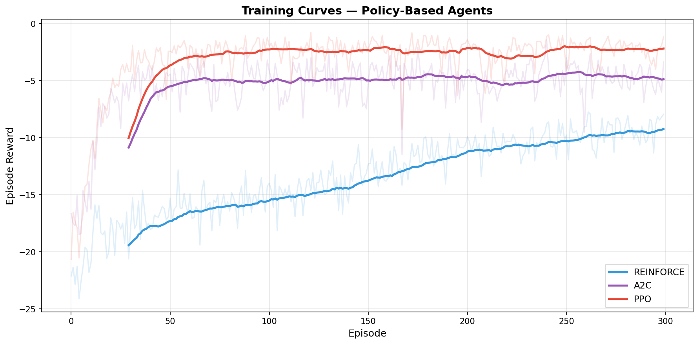

# Request Batching With Predictive Dyna Q

This folder contains the final implementation for request batching with a Predictive Dyna Q agent and supporting legacy baselines.

## Api Endpoints

Run the api service

```bash
python3 -m Ashrith.api_dynaq
```

Available endpoints

- `GET /health`
- `POST /infer`

Example request

```bash
curl -X POST http://127.0.0.1:8080/infer \
  -H "Content-Type: application/json" \
  -d '{"state":[0.1,0.1,0.1,0.1,0.2,0.3]}'
```

Example response

```json
{
  "action": 0,
  "action_name": "WAIT",
  "model": "predictive_dynaq_best.npy"
}
```

## How To Run

```bash
python3 -m Ashrith.train_agents --agent predictive_dynaq --episodes 300
python3 -m Ashrith.compare_all
python3 -m Ashrith.live_simulation
python3 -m Ashrith.api_dynaq
```

## Project Content

Main files

- `Ashrith/predictive_dynaq_agent.py`
- `Ashrith/train_agents.py`
- `Ashrith/compare_all.py`
- `Ashrith/live_simulation.py`
- `Ashrith/api_dynaq.py`

Support folders

- `Ashrith/env` for environment logic
- `Ashrith/baselines` for fixed and random policies
- `Ashrith/legacy` for reinforce a2c and ppo code and artifacts
- `Ashrith/checkpoints` for Predictive Dyna Q model files
- `Ashrith/logs` for Predictive Dyna Q training logs
- `Ashrith/results` for result outputs

## Methodology Summary

The environment provides a six feature normalized state.
The predictor estimates near future demand from grouped recent observations.
The policy selects wait or skip.
The learner updates a tabular action value model and planning model each step.
Evaluation is done across poisson bursty and time varying traffic with multiple seeds.

## Scores And Metrics

The final report metrics are saved in `Ashrith/results/final_evaluation_results.json`.
Core metrics are mean reward average wait p ninety five wait average batch size throughput and slo violation rate.

## Report Images

Training curves with all available model logs



Training curve for Predictive Dyna Q only



Legacy training curves kept for reference


