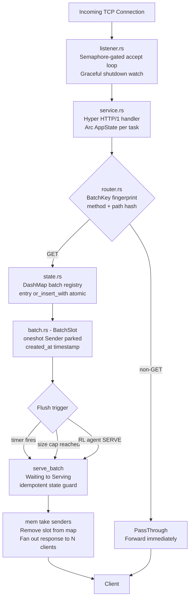
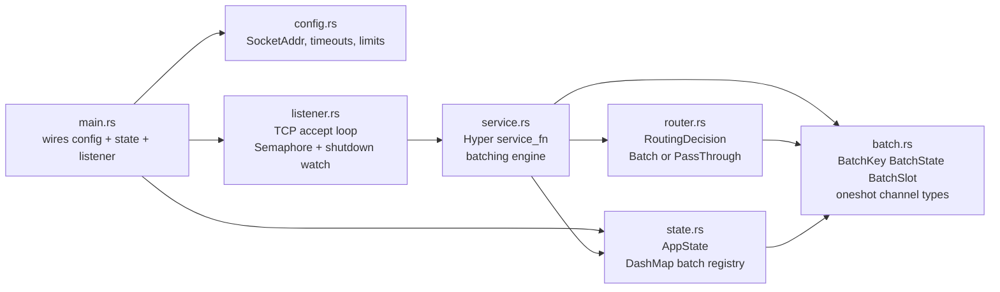
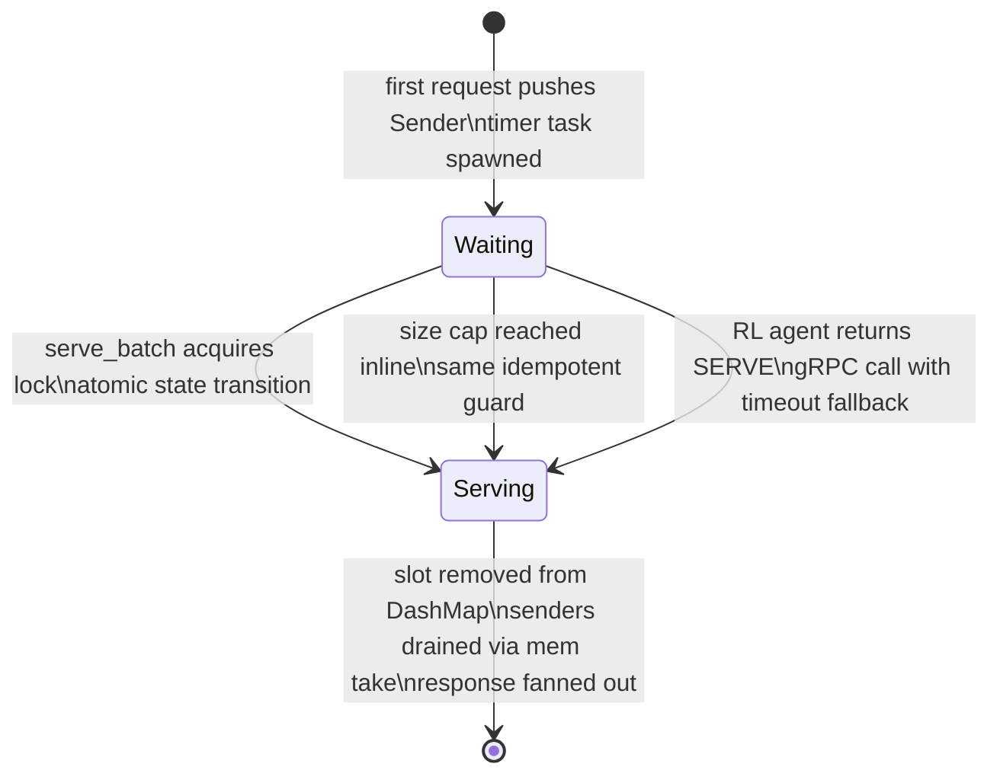
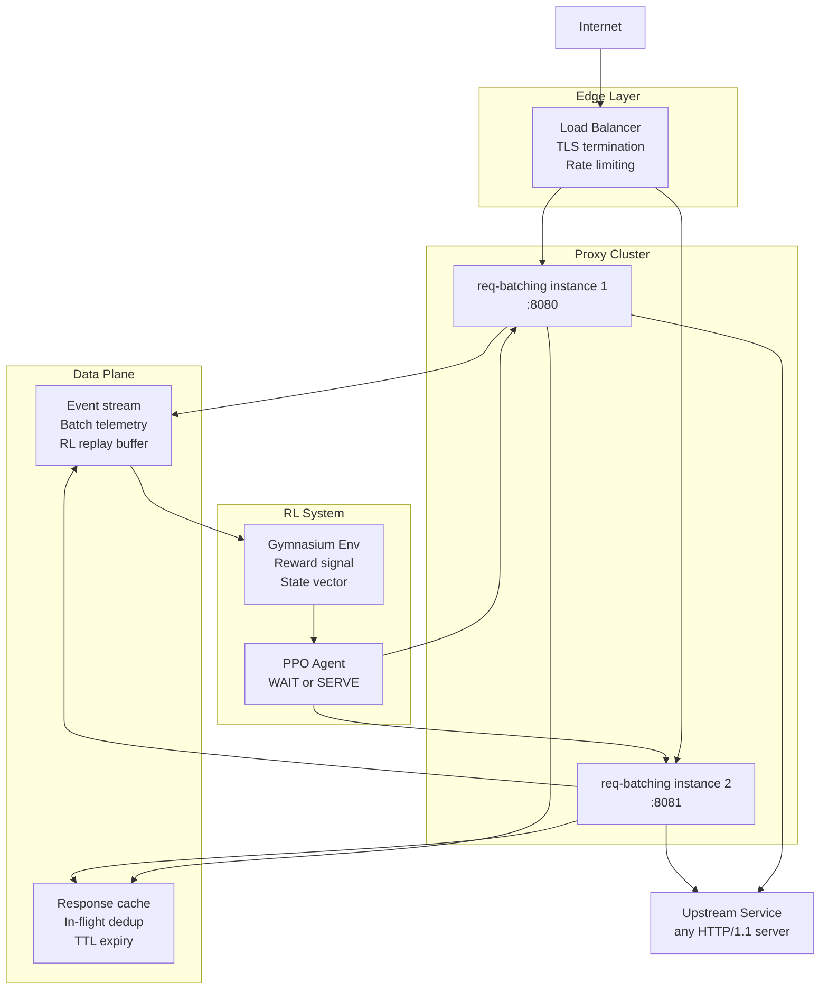

# req-batching

A high-performance HTTP reverse proxy in Rust that coalesces concurrent requests into batches and dispatches a single upstream call per batch. The flush decision is driven by a PPO reinforcement learning agent, replacing static timers with a policy that adapts to live traffic state.

---

## How It Works

Under bursty traffic, many clients hit the same endpoint within milliseconds of each other. Each request would ordinarily result in an independent upstream call. This proxy intercepts the burst, parks each request in a shared slot, and issues one upstream call when the RL agent decides the batch is ready. Every waiting client receives the same response through its own connection — the upstream never knows requests were coalesced.

The RL agent observes queue depth, arrival rate, batch age, and upstream p99 latency. It returns a binary WAIT or SERVE decision. When no agent is reachable, the proxy falls back to configurable timer and size-cap guards so the system degrades gracefully rather than stalling.

---

## Architecture

### Request Lifecycle



### Internal Module Dependencies



### Batch State Machine



### Production Deployment



---

## Project Layout

```
req-batching/
├── reverse-proxy/          # Core proxy engine
│   ├── Cargo.toml
│   └── src/
│       ├── main.rs         # Entry point — wires Config, AppState, listener
│       ├── config.rs       # Configuration struct (addr, timeouts, limits)
│       ├── state.rs        # Shared AppState — DashMap batch registry
│       ├── batch.rs        # BatchKey, BatchState, BatchSlot, channel types
│       ├── router.rs       # RoutingDecision — Batch or PassThrough
│       ├── listener.rs     # TCP accept loop, semaphore, graceful shutdown
│       └── service.rs      # Hyper HTTP handler, batching engine, serve_batch
├── rl/                     # PPO agent, Gymnasium environment, gRPC server
└── docs/                   # Design notes
```

---

## Getting Started

### Prerequisites

- Rust 1.80 or later (Cargo edition 2024)

```bash
curl --proto '=https' --tlsv1.2 -sSf https://sh.rustup.rs | sh
```

### Clone

```bash
git clone https://github.com/Raifu-Sutairu/req-batching.git
cd req-batching
```

### Build

```bash
cd reverse-proxy
cargo build --release
```

### Run

```bash
cargo run
# Listening on 127.0.0.1:8080
```

### Verify batching

Send concurrent GET requests to the same path. All of them will be held until the batch timeout elapses, then released simultaneously with a single upstream call.

```bash
for i in {1..8}; do
  curl -s http://127.0.0.1:8080/api/resource &
done
wait
```

Non-GET requests are routed directly without batching:

```bash
curl -X POST http://127.0.0.1:8080/api/resource \
     -H "Content-Type: application/json" \
     -d '{"key": "value"}'
```

### Configuration

```rust
// reverse-proxy/src/main.rs
let config = Arc::new(config::Config {
    listen_addr:      "127.0.0.1:8080".parse().unwrap(),
    max_connections:  1000,   // semaphore cap — controls memory ceiling
    batch_timeout_ms: 50,     // max hold time before timer-triggered flush
    max_batch_size:   128,    // max requests per slot before inline flush
});
```

| Field | Description |
|---|---|
| `listen_addr` | Socket the proxy binds to |
| `max_connections` | Global TCP connection cap enforced by semaphore |
| `batch_timeout_ms` | Maximum time a batch is held open |
| `max_batch_size` | Maximum requests per batch before early flush |

---

## Design

**Protocol-agnostic core.** The batching engine is decoupled from the upstream transport. The `serve_batch` function is the single extension point — swap it for a gRPC call, a queue producer, or a cache read without touching the slot or fan-out machinery.

**RL-driven flush policy.** The timer and size-cap triggers are safety nets, not the primary control path. In production, each batch decision is a gRPC call to the PPO agent. The agent's state vector — queue depth, arrival rate, batch age, upstream p99 — is extracted from live measurements on each incoming request. The agent trains against a reward signal that penalises added latency and rewards upstream call reduction.

**Minimal lock contention.** `DashMap` shards the registry across 16 buckets. Concurrent tasks serving different endpoints never touch the same shard. The inner `std::sync::Mutex` is held only for the duration of a `Vec::push` or `mem::take` — pure memory operations with no async yield, which is why `std::sync::Mutex` is used instead of `tokio::sync::Mutex`.

**Idempotent flush.** `serve_batch` is callable from the timer task and the size-cap path simultaneously. The first caller transitions the slot from `Waiting` to `Serving` under the lock; the second finds `Serving` and returns immediately. There is no coordination channel between the two paths — the state machine is the coordination.

**Zero-copy fan-out.** `std::mem::take` drains the sender vector without heap allocation. The `Mutex` guard is dropped before the fan-out loop so the lock is not held during response construction or channel sends.

---

## License

This project is licensed under the MIT License. See [LICENSE](./LICENSE) for the full text.
