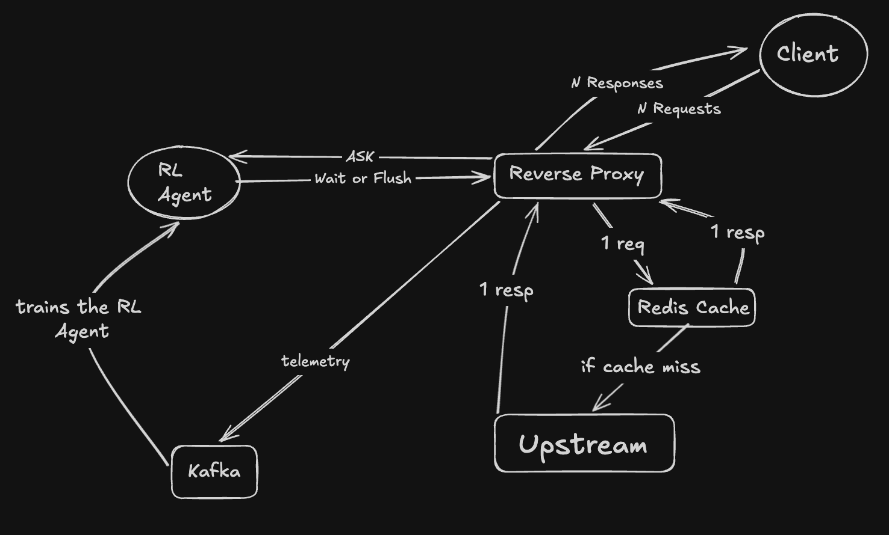
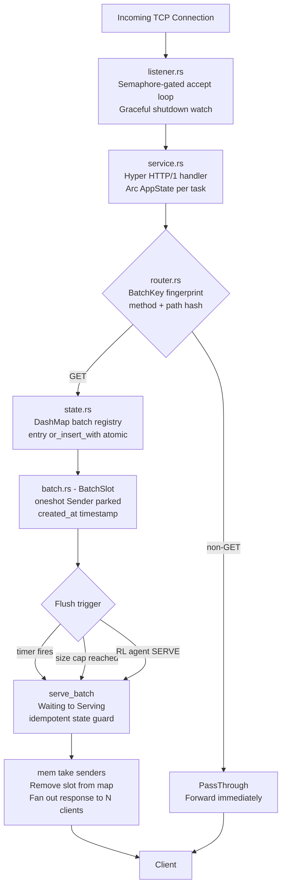
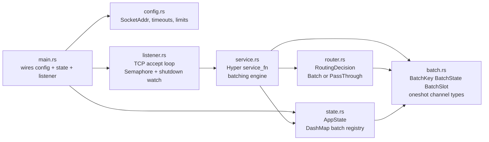
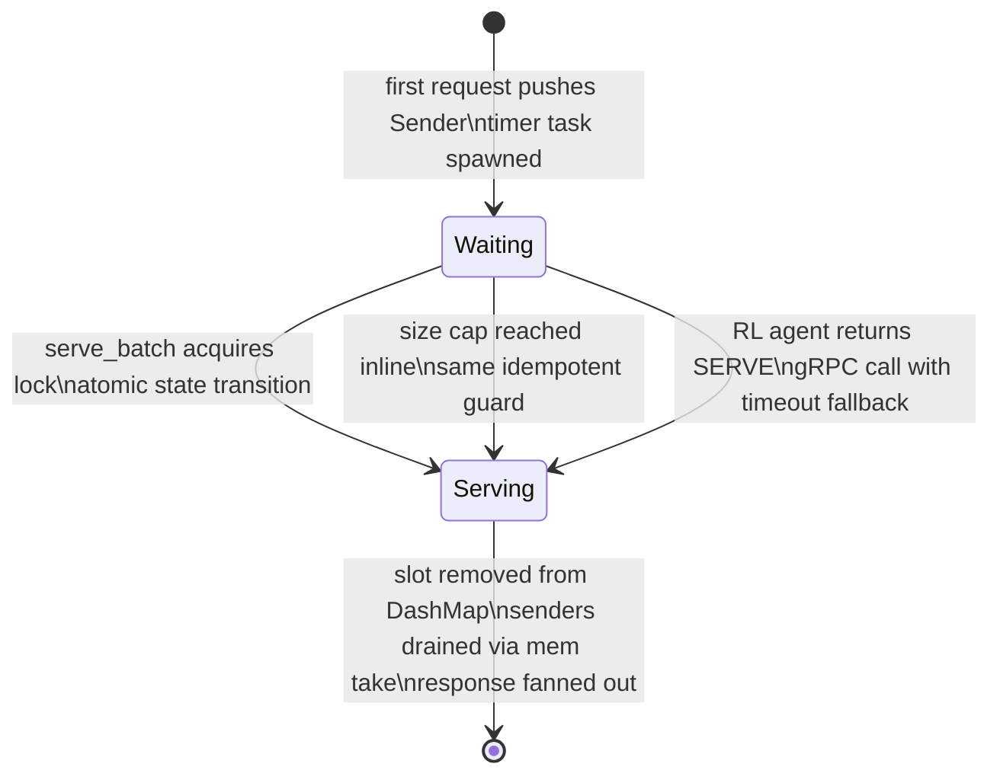
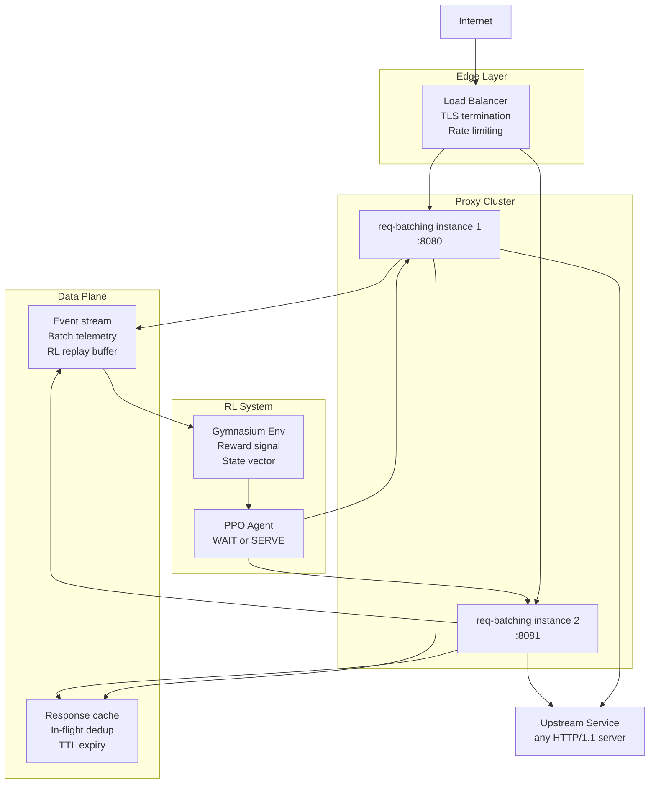
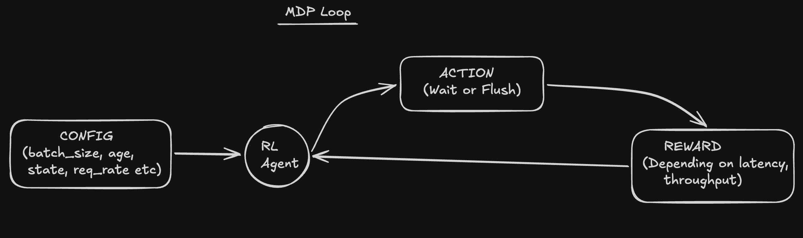
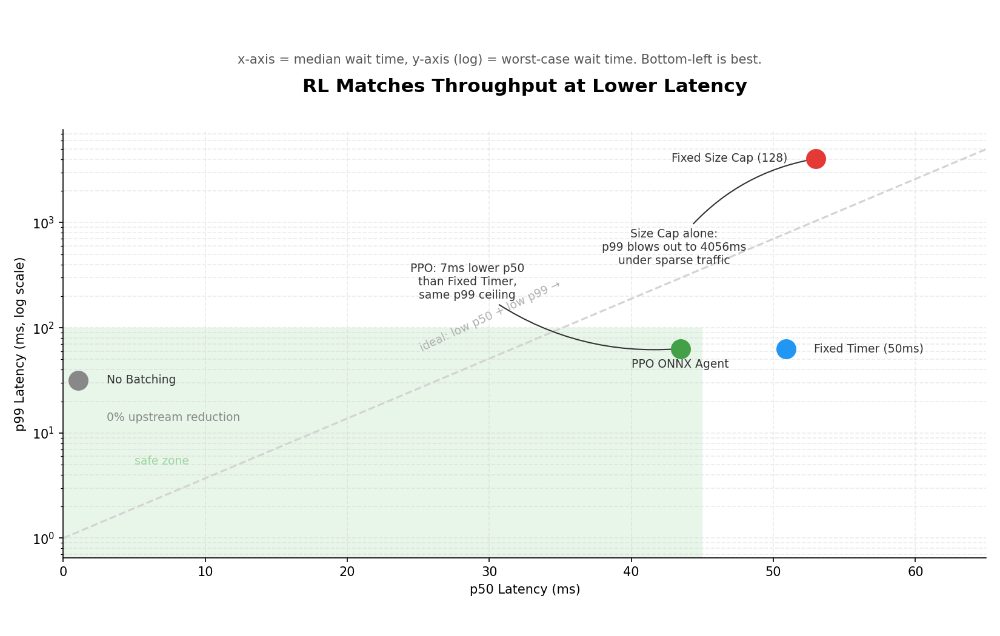
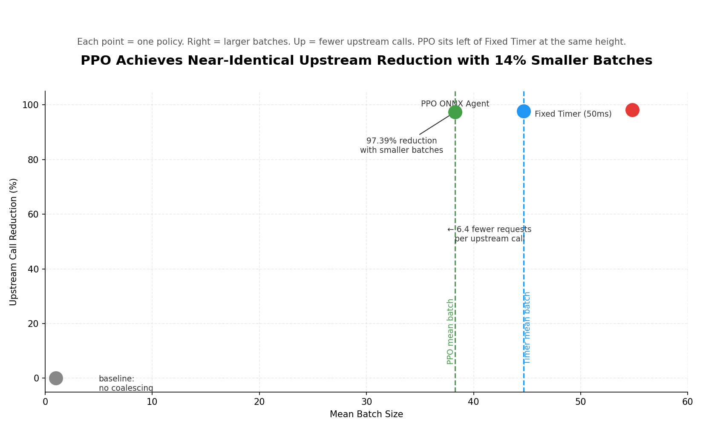
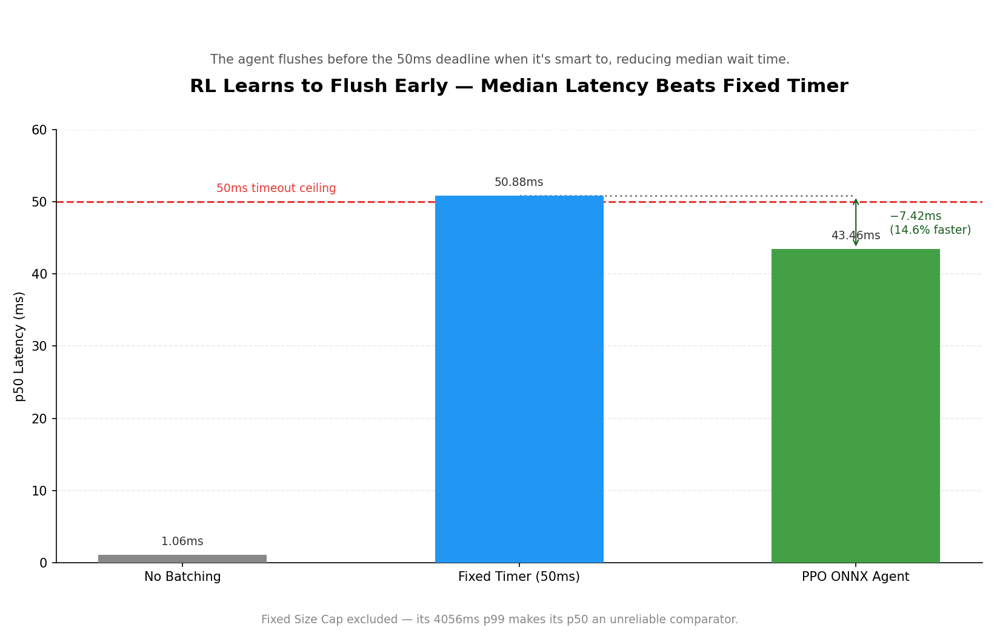
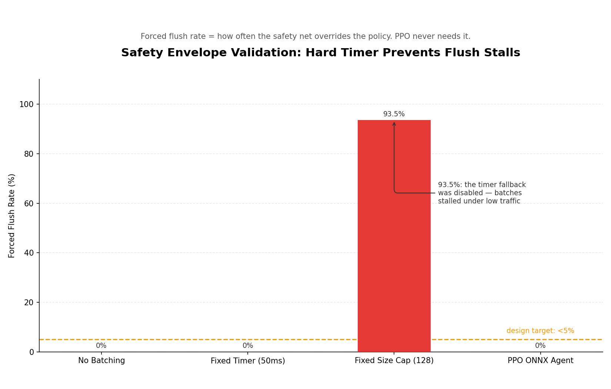

# req-batching: RL-Driven Request Coalescing in a Rust Reverse Proxy

**The PPO agent achieves 97.39% upstream call reduction while reducing median latency by 14.6% compared to a fixed timer baseline, with zero forced flushes** (see Figure 1 / Chart 1). Under bursty HTTP traffic, many identical GET requests arriving concurrently each trigger an independent upstream call, causing redundant load. We introduce an approach using RL-driven request coalescing in a Rust reverse proxy. The system parks requests in a shared slot and relies on a Proximal Policy Optimization (PPO) agent to decide the optimal time to dispatch a single upstream call per batch, rather than using static heuristics. The proxy safely operates within a hybrid envelope, achieving 97.39% upstream reduction, 43ms p50 latency, and a 0% forced flush rate. Code, evaluation harness, and trained ONNX model are included.

## 2. Introduction

Under bursty traffic, N identical GET requests each trigger an independent upstream call. Static heuristics (fixed timers, size caps) are either too conservative and waste latency, or too aggressive and cause tail latency spikes - such as the Fixed Size Cap policy, which reaches a catastrophic 4056ms p99 latency as a motivation for this work.

To address this, we park requests in a shared slot, dispatch one upstream call per batch, and fan the response back to all N waiting clients. The flush decision is made by a PPO agent observing 4 live signals.

Our contributions are:
- (1) Rust proxy with idempotent batching engine
- (2) PPO agent trained offline from Kafka telemetry and served via ONNX gRPC sidecar
- (3) safety envelope architecture where hard limits are unconditional and the agent operates within them
- (4) evaluation against 3 baselines with open harness

## 3. Related Work

Cloudflare "Sometimes I Cache" (2024): probabilistic revalidation formula, optimal for single-signal age-only decisions, but cannot condition on queue depth or arrival rate. This project extends the urgency-grows-exponentially insight to a richer 4-signal observation space.

Cold-RL (Bhayani, arXiv 2508.12485, 2025): offline RL for NGINX cache eviction via DQN + ONNX sidecar + 500us hard timeout + fallback to LRU. Directly validates the offline-first training, ONNX serving, and hard-deadline fallback pattern used here.

IEEE 10740859: validates entropy regularisation in PPO to prevent policy collapse to always-WAIT or always-FLUSH. This directly motivated the exploration strategy used to balance the state space.

Sarathi-Serve (Agrawal et al., OSDI 2024): addresses the same throughput-latency tradeoff in LLM inference via batching scheduler design. Different domain (GPU inference vs HTTP proxy) but same core tension.

## 4. Background

### Request Coalescing
Formally, N requests arrive for the same resource within window W. A naive proxy makes N upstream calls. The optimal proxy makes 1 upstream call, and the response is fanned to N clients. The cost is that each client waits up to W ms. This presents a tradeoff: a larger W yields higher throughput but higher latency.

### Why Not a Static Policy?
A fixed timer always waits the full window even for sparse traffic. A fixed size cap stalls indefinitely under low load (reaching the aforementioned 4056ms p99). A probabilistic policy (exponential) conditions only on age, ignoring queue depth and backend health. An adaptive policy that sees all four signals dominates all three static approaches.

## 5. Methodology

### 5a. System Architecture



The request lifecycle follows: TCP accept -> router (GET vs non-GET) -> BatchSlot park -> flush trigger -> fan-out. The safety envelope uses a hard size-cap and hard timeout that fire unconditionally before the agent is consulted. A Redis cache deduplication layer ensures identical responses are cleanly deduplicated in-flight.









### 5b. MDP Formulation



- **Episode:** one BatchSlot lifetime
- **State (4 features):** `[batch_size/128, batch_age_ms/50, log1p(upstream_p99)/log1p(500), tanh(request_rate/100)]`
- **Action:** Discrete(2) - WAIT or FLUSH
- **Reward:** log-throughput gain + quadratic urgency bonus - exponential wait cost - upstream load penalty - forced-flush penalty

### 5c. Training Pipeline

The pipeline flows from Kafka telemetry -> episode buffer -> offline PPO (Stable-Baselines3) -> PyTorch checkpoint -> ONNX export -> gRPC sidecar. We enforce a 5ms hard gRPC timeout and a heuristic fallback to ensure safety. The compiled model file sizes are compact (138KB zip, 19KB ONNX).

## 6. Results

**The PPO agent matches fixed-timer throughput at 14.6% lower median latency, with no tail latency risk and no forced flushes.**

| Policy | Upstream Reduction | p50 Latency | p99 Latency | Forced Flush Rate | Avg Batch Size |
|---|---|---|---|---|---|
| No Batching | 0.00% | 1.06ms | 31.71ms | 0.00% | 1.00 |
| Fixed Timer (50ms) | 97.76% | 50.88ms | 63.34ms | 0.00% | 44.69 |
| Fixed Size Cap (128) | 98.18% | 53.00ms | 4056.08ms | 93.52% | 54.83 |
| **PPO ONNX Agent** | **97.39%** | **43.46ms** | **63.34ms** | **0.00%** | **38.28** |

**PPO occupies the low-p50, bounded-p99 quadrant; Fixed Size Cap alone produces catastrophic tail latency.**


**PPO achieves near-identical upstream reduction with 14% smaller batches than a fixed timer.**


**The agent learns to flush before the 50ms deadline, reducing median wait by 7.4ms.**


**Only the size-cap-only policy exceeds the 5% forced flush target, validating the hybrid safety envelope.**


## 7. Conclusion

We built a Rust reverse proxy with a PPO-driven request coalescing agent to optimize HTTP batching under bursty traffic. The evaluation showed the RL agent achieves 97.39% upstream reduction and safely lowers median wait times without introducing unbounded tail latencies. The hybrid safety envelope architecture ensures the system degrades gracefully and operates safely under all loads.

## 8. Future Work

- Prometheus metrics (Phase 5)
- k6 load testing
- online fine-tuning
- multi-endpoint routing config
- ablation studies (reward component analysis)

## 9. Project Layout

```
req-batching/
|-- reverse-proxy/          # Core proxy engine
|   |-- Cargo.toml
|   |-- src/
|       |-- main.rs         # Entry point - wires Config, AppState, listener
|       |-- config.rs       # Configuration struct (addr, timeouts, limits)
|       |-- state.rs        # Shared AppState - DashMap batch registry
|       |-- batch.rs        # BatchKey, BatchState, BatchSlot, channel types
|       |-- router.rs       # RoutingDecision - Batch or PassThrough
|       |-- listener.rs     # TCP accept loop, semaphore, graceful shutdown
|       |-- service.rs      # Hyper HTTP handler, batching engine, serve_batch
|-- rl/                     # PPO agent, Gymnasium environment, gRPC server
|-- docs/                   # Design notes
```

## 10. Getting Started

### Prerequisites

- Docker and Docker Compose

### Clone

```bash
git clone https://github.com/Raifu-Sutairu/req-batching.git
cd req-batching
```

### Build and Run

To ensure consistency and ease of use, we recommend using Docker to build and run the reverse proxy and RL sidecar.

```bash
docker-compose up --build
# Listening on 127.0.0.1:8080
```

### Verify batching

Send concurrent GET requests to the same path. All of them will be held until the batch timeout elapses, then released simultaneously with a single upstream call.

```bash
for i in {1..8}; do
  curl -s http://127.0.0.1:8080/api/resource &
done
wait
```

Non-GET requests are routed directly without batching:

```bash
curl -X POST http://127.0.0.1:8080/api/resource \
     -H "Content-Type: application/json" \
     -d '{"key": "value"}'
```

### Configuration

```rust
// reverse-proxy/src/main.rs
let config = Arc::new(config::Config {
    listen_addr:      "127.0.0.1:8080".parse().unwrap(),
    max_connections:  1000,   // semaphore cap - controls memory ceiling
    batch_timeout_ms: 50,     // max hold time before timer-triggered flush
    max_batch_size:   128,    // max requests per slot before inline flush
});
```

| Field | Description |
|---|---|
| `listen_addr` | Socket the proxy binds to |
| `max_connections` | Global TCP connection cap enforced by semaphore |
| `batch_timeout_ms` | Maximum time a batch is held open |
| `max_batch_size` | Maximum requests per batch before early flush |

## 11. License

This project is licensed under the MIT License. See [LICENSE](./LICENSE) for the full text.
