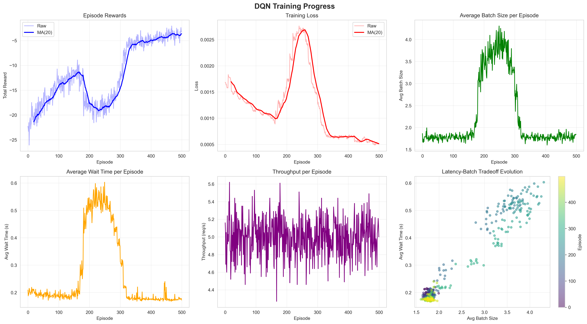
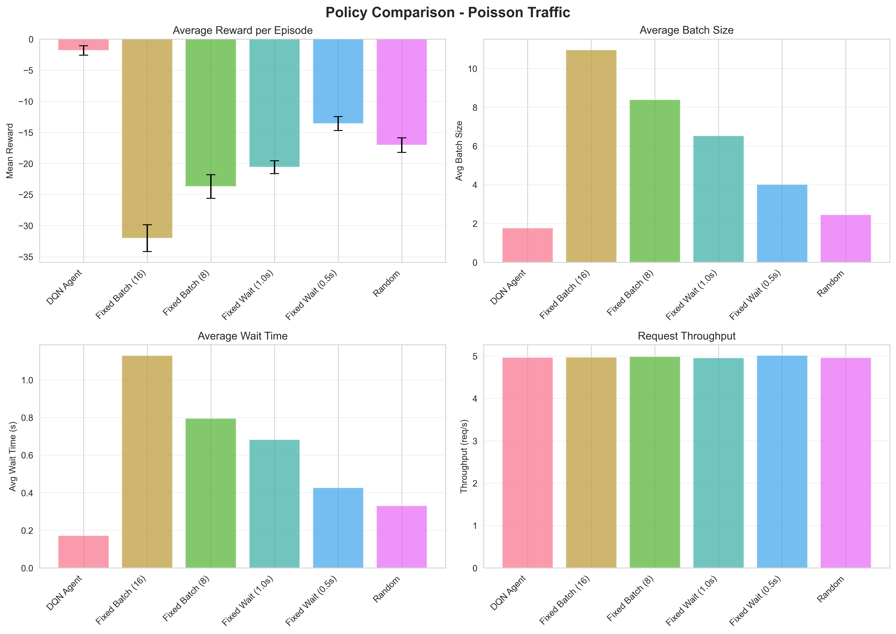

# Intelligent Request Batching and Routing System

An intelligent request batching system that uses **Deep Q-Network (DQN)** reinforcement learning to optimize the tradeoff between **batch efficiency** (throughput) and **real-time responsiveness** (latency) in a reverse proxy.

## 🎯 Problem Overview

In distributed systems, batching requests before forwarding them to backend services improves throughput but increases latency. This system learns an **adaptive batching policy** that:

- ✅ **Waits** when batching improves efficiency without hurting latency
- ✅ **Skips** (sends batch) when waiting would cause unacceptable delay
- ✅ **Adapts** to varying traffic patterns (Poisson, bursty, time-varying)

## 🧠 Reinforcement Learning Approach

### Why DQN?

**Q-Learning is unsuitable** because our state space is continuous (wait times, queue lengths). **DQN solves this** by using a neural network to approximate the Q-function.

### MDP Formulation

**State Space** (6 features, normalized to [0,1]):
```
[batch_size, wait_time, queue_length, time_since_last_skip, 
 arrival_rate, system_load]
```

**Action Space**:
- `0 = WAIT`: Keep batching more requests
- `1 = SKIP`: Send current batch to backend

**Reward Function**:
```python
reward = α × (batch_size / max_batch_size)           # efficiency
       - β × (wait_time / max_wait_time)²           # latency penalty
       - action_cost                                # decisiveness
```

- `α` (alpha): Weight for batch efficiency (higher = prefers larger batches)
- `β` (beta): Weight for latency penalty (higher = prefers lower wait times)

### Algorithm Features

- **Deep Q-Network** with 3-layer MLP (128-64-2)
- **Experience Replay** for stable learning
- **Target Network** updated every 10 episodes
- **Epsilon-greedy** exploration (ε: 1.0 → 0.01)

---

## 📦 Installation

### 1. Clone or Navigate to Project

```bash
cd /Users/sudarshansudhakar/Desktop/Semester\ 6/RL\ Project
```

###2. Install Dependencies

```bash
pip install -r requirements.txt
```

**Required packages**:
- `gymnasium` - OpenAI Gym environment
- `torch` - PyTorch for DQN
- `numpy`, `matplotlib`, `pandas`, `seaborn` - Data & visualization

---

## 🚀 Quick Start

### Training

Train the DQN agent with default settings:

```bash
python main.py --mode train --episodes 500
```

**Custom hyperparameters**:
```bash
python main.py --mode train \
  --episodes 500 \
  --traffic poisson \
  --alpha 1.0 \
  --beta 2.0 \
  --lr 0.001 \
  --gamma 0.99
```

**Arguments**:
- `--episodes`: Number of training episodes (default: 500)
- `--traffic`: Traffic pattern (`poisson`, `bursty`, `time_varying`)
- `--alpha`: Batch efficiency weight (default: 1.0)
- `--beta`: Latency penalty weight (default: 2.0)
- `--lr`: Learning rate (default: 0.001)
- `--gamma`: Discount factor (default: 0.99)
- `--seed`: Random seed (default: 42)

**Outputs**:
- Model checkpoints saved to `checkpoints/`
- Training logs saved to `logs/training_logs.json`
- Training curves saved to `results/training_curves.png`

### Evaluation

Evaluate a trained model:

```bash
python main.py --mode eval --model checkpoints/dqn_best.pth --traffic poisson
```

### Compare with Baselines

Compare DQN against naive policies:

```bash
python main.py --mode compare --model checkpoints/dqn_best.pth --traffic poisson
```

**Baseline policies**:
- Fixed Batch Size (8, 16)
- Fixed Wait Time (0.5s, 1.0s)
- Random Policy

**Outputs**:
- Comparison plots saved to `results/comparison_{traffic}.png`

### Plot Training Curves

Visualize training progress:

```bash
python main.py --mode plot
```

---

## 📊 Hyperparameter Tuning

### Reward Function Weights

**Alpha (α) - Batch Efficiency**:
- Higher α → Agent prefers larger batches (better throughput, higher latency)
- Lower α → Agent cares less about batch size

**Beta (β) - Latency Penalty**:
- Higher β → Agent strongly avoids waiting (better latency, smaller batches)
- Lower β → Agent tolerates longer waits

**Example configurations**:

```bash
# Throughput-focused (large batches, tolerate latency)
python main.py --mode train --alpha 2.0 --beta 1.0

# Latency-focused (small batches, low wait times)
python main.py --mode train --alpha 0.5 --beta 3.0

# Balanced (default)
python main.py --mode train --alpha 1.0 --beta 2.0
```

### DQN Hyperparameters

| Parameter | Default | Description |
|-----------|---------|-------------|
| `learning_rate` | 0.001 | Adam optimizer learning rate |
| `gamma` | 0.99 | Discount factor for future rewards |
| `epsilon_start` | 1.0 | Initial exploration rate |
| `epsilon_end` | 0.01 | Final exploration rate |
| `epsilon_decay` | 0.995 | Epsilon decay per episode |
| `batch_size` | 64 | Training batch size from replay buffer |
| `buffer_capacity` | 10000 | Replay buffer capacity |
| `target_update_freq` | 10 | Episodes between target net updates |

**Tuning tips**:
- If training is unstable → increase `target_update_freq`
- If agent converges too fast → decrease `epsilon_decay`
- If agent doesn't learn → increase `learning_rate` or decrease `gamma`

---

## 📈 Visualization

### Training Curves

Automatically generated during training:



**Plots include**:
1. Episode rewards (raw + moving average)
2. Training loss
3. Average batch size over time
4. Average wait time over time
5. Throughput evolution
6. Latency-batch tradeoff scatter

### Policy Comparison

Compare DQN vs baselines:



**Metrics compared**:
- Total reward per episode
- Average batch size
- Average wait time
- Request throughput

---

## 🧪 Traffic Patterns

### Poisson (Constant Rate)

Uniform arrival rate (default: 5 req/sec):
```bash
python main.py --mode train --traffic poisson
```

### Bursty

Alternates between high/low traffic bursts:
```bash
python main.py --mode train --traffic bursty
```

### Time-Varying

Simulates peak hours (higher rate) vs idle periods:
```bash
python main.py --mode train --traffic time_varying
```

---

## 📁 Project Structure

```
rl_batching_system/
├── env/
│   ├── batching_env.py          # Custom Gym environment
│   └── traffic_generator.py     # Traffic simulation
├── agent/
│   ├── dqn_agent.py             # DQN implementation
│   ├── replay_buffer.py         # Experience replay
│   └── network.py               # Neural network
├── training/
│   ├── train.py                 # Training loop
│   ├── evaluate.py              # Evaluation utilities
│   └── config.py                # Hyperparameters
├── baselines/
│   └── naive_policies.py        # Baseline policies
├── visualization/
│   ├── plot_rewards.py          # Training plots
│   └── compare_policies.py      # Policy comparison
├── main.py                      # Entry point
├── requirements.txt
└── README.md
```

---

## 🔬 Environment Details

### State Observation (6D vector)

| Feature | Description | Range |
|---------|-------------|-------|
| `batch_size` | Current batch size (normalized) | [0, 1] |
| `wait_time` | Time since first request in batch | [0, 1] |
| `queue_length` | Requests waiting (normalized) | [0, 1] |
| `time_since_last_skip` | Time since last batch sent | [0, 1] |
| `arrival_rate` | Recent arrival rate (EMA) | [0, 1] |
| `system_load` | Simulated CPU/latency | [0, 1] |

### Episode Configuration

- **Duration**: 1000 time steps (default)
- **Time step**: 0.1 seconds
- **Max batch size**: 32 requests
- **Max wait time**: 2.0 seconds
- **Max queue length**: 100 requests

---

## 🎓 Theoretical Background

### Why This Matters

In real-world systems like:
- **CDNs** (as mentioned in the ICCA-RL abstract)
- **API Gateways**
- **Database connection pools**
- **Message queues**

Batching improves efficiency but degrades user experience if overdone. Traditional approaches use **fixed thresholds** (batch size or timeout), which don't adapt to traffic.

### RL Advantage

Our DQN agent **learns** the optimal policy by:
1. **Observing** traffic patterns dynamically
2. **Balancing** conflicting objectives (throughput vs latency)
3. **Adapting** to varying load conditions

---

## 📝 Example Usage

### Complete Training Pipeline

```bash
# 1. Train DQN agent
python main.py --mode train --episodes 500 --traffic bursty --alpha 1.5 --beta 2.5

# 2. Evaluate trained model
python main.py --mode eval --model checkpoints/dqn_best.pth --traffic bursty

# 3. Compare with baselines
python main.py --mode compare --model checkpoints/dqn_best.pth --traffic bursty

# 4. Plot training curves
python main.py --mode plot
```

### Programmatic Usage

```python
from env import BatchingEnv
from agent import DQNAgent
from training import TrainingConfig, train_agent

# Create custom config
config = TrainingConfig(
    num_episodes=300,
    traffic_pattern='time_varying',
    alpha=1.2,
    beta=2.0,
    learning_rate=0.0005
)

# Train agent
agent, logs = train_agent(config)

# Evaluate
from training import evaluate_agent
env = BatchingEnv(traffic_pattern='time_varying')
results = evaluate_agent(agent, env, num_episodes=20)

print(f"Mean Reward: {results['mean_reward']:.3f}")
print(f"Avg Batch Size: {results['mean_batch_size']:.2f}")
```

---

## 🚀 Advanced: Multi-Pattern Training

Train on all traffic patterns and compare:

```bash
# Train on each pattern
for traffic in poisson bursty time_varying; do
  python main.py --mode train --episodes 400 --traffic $traffic
  mv checkpoints/dqn_best.pth checkpoints/dqn_${traffic}.pth
done

# Compare all
for traffic in poisson bursty time_varying; do
  python main.py --mode compare --model checkpoints/dqn_${traffic}.pth --traffic $traffic
done
```

---

## 🔍 Expected Results

A well-trained DQN agent should:

✅ **Outperform baseline policies** in total reward  
✅ **Achieve larger batch sizes** than fixed-wait policies  
✅ **Maintain lower latency** than fixed-batch policies  
✅ **Adapt behavior** to traffic intensity (larger batches during peaks, responsive during idle)

**Success criteria**:
- Mean reward > all baselines across all traffic patterns
- Balanced latency-throughput tradeoff

---

## 🛠️ Troubleshooting

### Training not converging

- Increase `target_update_freq` (e.g., 20)
- Decrease `learning_rate` (e.g., 0.0005)
- Increase `epsilon_decay` (e.g., 0.998) for more exploration

### Agent too conservative (always waits)

- Increase `beta` to penalize waiting more heavily
- Decrease `alpha` to reduce batch size preference

### Agent too aggressive (always skips)

- Increase `alpha` to reward batching
- Decrease `beta` to tolerate longer waits

### PyTorch device errors

Specify device explicitly:
```bash
# Force CPU
python main.py --mode train --device cpu

# Use MPS (M1 Mac)
python main.py --mode train --device mps
```

---

## 📚 References

- **DQN Paper**: Mnih et al., "Playing Atari with Deep Reinforcement Learning" (2013)
- **Related Work**: ICCA-RL (Intelligent Compression-Cache Awareness in Nginx via RL)
- **Gym Documentation**: https://gymnasium.farama.org/

---

## 📧 Contact

For questions or improvements, feel free to extend this project!

**Key Features**:
- ✅ Complete RL implementation
- ✅ Multiple traffic patterns
- ✅ Baseline comparisons
- ✅ Comprehensive visualization
- ✅ Tunable hyperparameters
- ✅ Reproducible results

---

## 🎉 Next Steps

After training:

1. **Analyze** training curves to verify convergence
2. **Compare** DQN with baselines on all traffic patterns
3. **Tune** α and β to find optimal latency-throughput balance
4. **Experiment** with different network architectures
5. **Extend** to multi-agent scenarios (multiple proxies)

**Enjoy optimizing your batching policy! 🚀**
