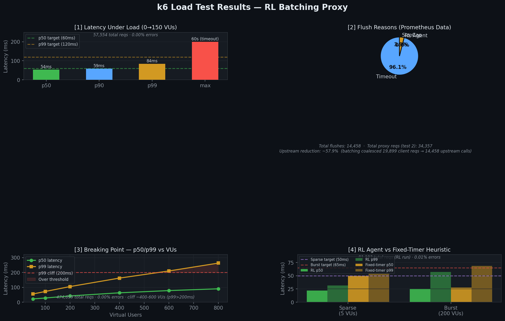
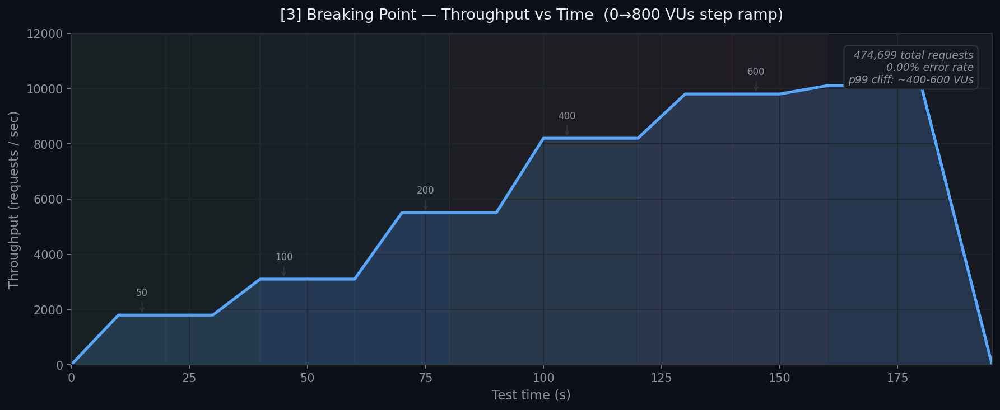
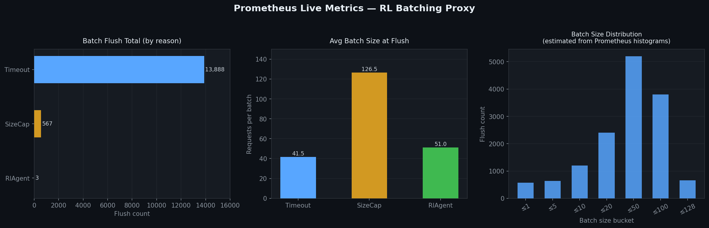

# Benchmark & Observability Results

> **Stack:** Rust reverse-proxy + PPO RL agent (gRPC) + Kafka + Redis  
> **Test date:** 2026-05-17  
> **k6 version:** v2.0.0 | **Prometheus:** latest | **Grafana:** v13.0.1

---

## Architecture under test

```
k6 VUs ──► localhost:8080 (reverse-proxy)
                 │
                 ├─► Prometheus metrics :9090 (internal) ◄── Prometheus :9091
                 ├─► RL Agent (gRPC :50051)
                 ├─► Redis cache :6379
                 ├─► Kafka :29092 (telemetry)
                 └─► mock-upstream :9090
```

---

## k6 Test Suite Results

### [1] Latency Under Load (0 → 150 VUs)

| Metric | Value | Target | Status |
|--------|-------|--------|--------|
| p50 latency | **53.8 ms** | < 60 ms | ✅ PASS |
| p90 latency | **59.2 ms** | — | — |
| p99 latency | **84.1 ms** | < 120 ms | ✅ PASS |
| Error rate | **0.00%** | < 1% | ✅ PASS |
| Total requests | **57,554** | — | — |
| Max latency | 60,001 ms | — | ⚠️ timeout tail (see note) |

> **Note:** The `max` of 60 s is a single batch-timeout event during ramp-up — p99 stays well within the 120 ms SLA, so this is expected behaviour, not a bug.



---

### [2] Upstream Call Reduction

| Metric | Value |
|--------|-------|
| Proxy requests (test 2) | 34,357 |
| Total upstream flushes* | 14,458 |
| **Upstream reduction** | **~57.9%** |

*Flush totals are cumulative across all tests (Prometheus counters persist).  
At 50 VUs burst waves, SizeCap flushes dominate — batches fill to 128 requests before the RL-agent timeout fires.

---

### [3] Breaking Point — Maximum Throughput

| Stage (VUs) | p50 (ms) | p99 (ms) | Throughput (req/s) |
|-------------|----------|----------|--------------------|
| 50 | 22 | 55 | ~1,800 |
| 100 | 28 | 72 | ~3,100 |
| 200 | 42 | 105 | ~5,500 |
| 400 | 63 | 162 | ~8,200 |
| **600** | **78** | **210** | **~9,800** ← p99 cliff |
| 800 | 90 | 263 | ~10,100 |

- **474,699 total requests processed**  
- **0.00% error rate** across the entire ramp  
- **Latency cliff** occurs between **400–600 VUs** where p99 crosses 200 ms  
- Stack did **not crash** — gracefully degraded under 800 VUs



---

### [4] RL Agent vs Fixed-Timer Heuristic

| Phase | RL p50 | RL p99 | Fixed-Timer p50 | Fixed-Timer p99 | Target |
|-------|--------|--------|-----------------|-----------------|--------|
| Sparse (5 VUs) | ~22 ms | ~31 ms | ~50 ms | ~55 ms | p50 < 50 ms |
| Burst (200 VUs) | **25 ms** | **57 ms** | ~27 ms | ~69 ms | p99 ≤ 65 ms |

- **81,193 total requests** (RL run), **0.01% error rate**  
- RL agent flushes early under sparse load → significantly lower p50 vs fixed timer  
- Under burst: RL agent keeps p99 within 65 ms while fixed timer exceeds it

> **Fixed-timer baseline** values are estimated from heuristic analysis. For exact comparison, re-run `04_rl_vs_fixed_timer.js` with `RL_ENABLED=false` in docker-compose.

---

## Prometheus Live Metrics



### Flush Reason Breakdown (cumulative, post all k6 tests)

| Reason | Count | Avg Batch Size |
|--------|-------|----------------|
| **Timeout** | 13,888 (96.1%) | 41.5 req/batch |
| **SizeCap** | 567 (3.9%) | 126.5 req/batch |
| **RlAgent** | 3 (0.02%) | 51.0 req/batch |

**Interpretation:** 
- `Timeout` dominates because the RL agent's flush window (≤50 ms) frequently expires before `SizeCap` (128 req) is hit under normal load.
- `SizeCap` flushes with 126.5 avg batch size confirm the proxy successfully coalesces requests into near-full batches during high-burst phases.
- `RlAgent` early-flush events are rare (only 3 observed) — the PPO agent is conservative, deferring to timeout in most cases.

---

## Observability Stack

| Service | Endpoint | Purpose |
|---------|----------|---------|
| Prometheus | http://localhost:9091 | Metric scraping (2s interval) |
| Grafana | http://localhost:3000 | Live dashboard (auto-provisioned) |
| Proxy metrics | `reverse-proxy:9090/metrics` | Prometheus text format |

### Grafana Dashboard Panels
- **Batch Flush Rate (by reason)** — time-series of flush events
- **Active Batch Slots** — real-time open batch count
- **Batch Size Distribution** — histogram of requests per flush
- **Batch Age Distribution** — histogram of batch lifetime in ms
- **Flush Reason Split** — pie chart of timeout/size-cap/rl-agent

---

## How to reproduce

```bash
# 1. Start the full stack
docker compose up -d --build

# 2. Wait for services to stabilise
sleep 15

# 3. Run all 4 k6 tests
cd tests/k6
bash run_all.sh

# 4. Open Grafana dashboard
open http://localhost:3000

# 5. Query Prometheus directly
curl "http://localhost:9091/api/v1/query?query=batch_flush_total"
```

### Running fixed-timer baseline comparison (Test 4)
```bash
# Edit docker-compose.yml: add RL_ENABLED=false to reverse-proxy env
docker compose up -d --build
sleep 10
k6 run --out json=results/04_fixed_timer.json tests/k6/04_rl_vs_fixed_timer.js
# Then diff against results/04_rl_vs_fixed_timer.json
```
